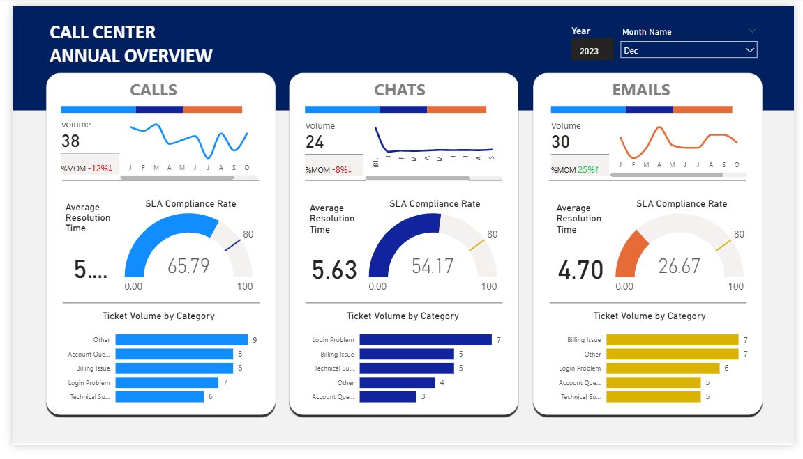

# 📞 Call Center Performance Insights: Power BI Dashboard
An interactive Power BI report designed to monitor and analyze **call center performance metrics**.  
This dashboard provides a detailed view of ticket volumes, resolution times, SLA compliance, and communication channels—helping business leaders optimize customer support efficiency.  

## 📊 Dashboard Preview

